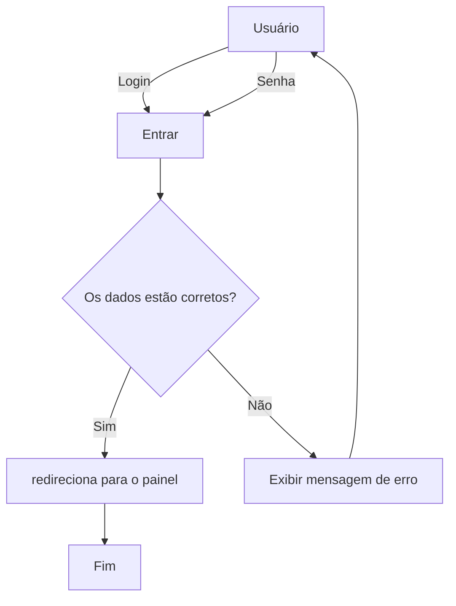

// Crie um fluxograma que represente o processo de login em um sistema:

Usuário insere login e senha

Verifica se os dados estão corretos

Se sim, redireciona para o painel

Se não, exibe mensagem de erro e retorna para o usuário
